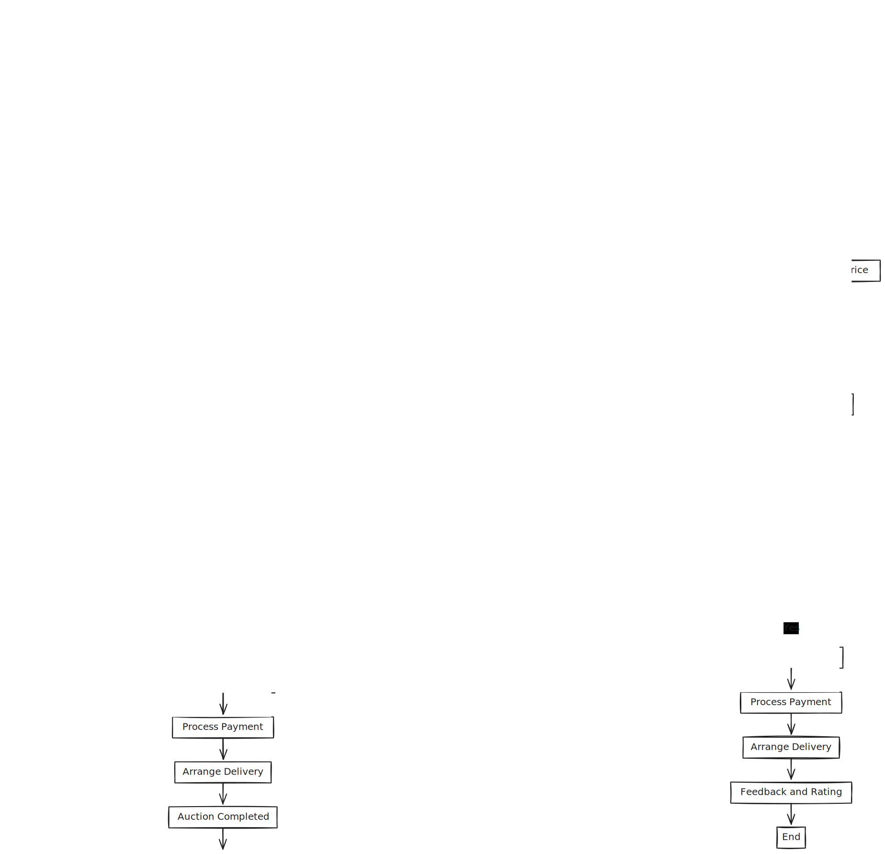

# BidNest

An online auction system facilitates the buying and selling of products or services by allowing users to bid against each other over the internet. The system typically includes functionalities for user registration, listing items for auction, bidding, and closing auctions. It also manages payment processing and order fulfillment. The process begins with sellers registering and listing their items, including descriptions and starting prices. Buyers register to participate in auctions, place bids, and the highest bid at the end of the auction wins. The system then processes the payment and arranges for the delivery of the item.

